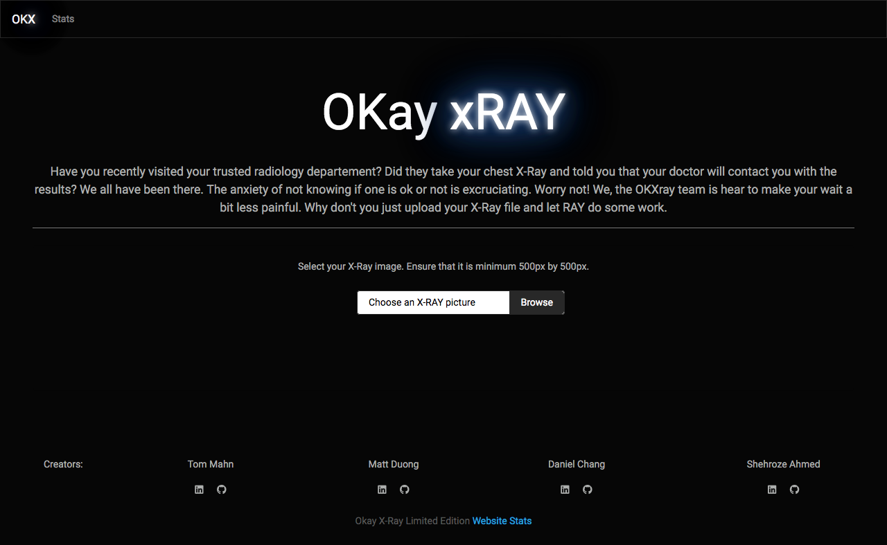

# Okay Your X-Ray

As we continue to adapt to the new world the pandemic has introduced to us, we are in a state where equipping ourselves with miniature bottles of hand sanitizer, donning our faces with medical masks, and greeting our neighbours from six feet away, have quickly become the social norm.

The pandemic, like other illnesses which affect the lungs is tragic, it is with thoughts of tragedy which have led down a path of wanting people receive news if they have any ailments of the lungs, as quickly as possible through just providing us an x-ray. 

Our mission is to build a model in which we are able to read a patient’s x-ray of torsos, classify and give probability to whether the patient has an ailment or affliction of the lung. We will also provide an option for the patient to state whether or not they have already received a confirmed diagnosis from the doctor. We would then use this data to continually train our model. 

Where is our dataset coming from?
https://www.kaggle.com/pcbreviglieri/covid-19-revisiting-pneumonia-detection?select=test

https://www.kaggle.com/nikhilpandey360/chest-xray-masks-and-labels

## Technologies used:
-	Convolutional Neural Network (CNN)
-	Python Pandas
-	HTML/CSS/Bootstrap
-	JavaScript D3.js

## Left to do:
- A method of uploading and analyzing multiple images simultaneously
- formating on the results page
